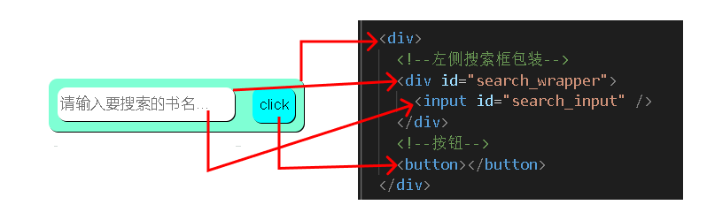
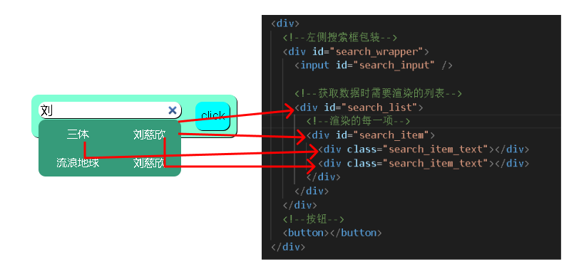

# node.js + MYSQL 最简实现搜索框


_仅为原理学习参考，不考虑其他优化_

## 🥩 使用技术

- 前端：`HTML` `CSS` `JS`
- 后端：`nodejs`、`MySQL`、`express`

## 🍗 环境要求

- `nodejs` 16+ ltsgf
- `MySQL`

## 🍖 开始使用

1. 导入 `assets/lemonsread.sql` 至本地的 `Mysql` 来创建对应的 `数据库` 、 `表` 以及所需的数据
2. 更改 `server/index.js` 里的 createConnnection 函数所需对象的属性 `user` `password` 为本地自己的用户名和密码
3. 打开 `terminal`，执行 `npm i` 安装项目所需依赖
4. 执行 `npm run start` 开始启动项目
5. OK，现在项目已经成功运行了！

## 🍔 技术原理

### 前端方面的技术原理

#### 流程

**_我们需要在用户输入的时候执行监听的回调，在回调函数里用 `fetch`
函数获取数据，然后再渲染生成数据_**

下方的图是 HTML 结构以及效果

- 【搜索前】
  
- 【搜索后】
  

#### 获取数据

前置知识：

1. 事件
2. [Promise](https://developer.mozilla.org/zh-CN/docs/Web/JavaScript/Reference/Global_Objects/Promise)

```ts
//在不修改 浏览器地址获取数据本质上就是用 AJAX
//现代浏览器内置了一个易用的函数 fetch()
//通过使用 fetch() 函数可以请求 Data
fetch( url,opts? ) : Promise<Response>

//例如此项目的 fetch 例子
fetch( "http://localhost:8080/" )

//返回的 promise 通过调用 then() 传递回调函数
.then(
    res => {
        console.log(res)
        return res.json()
    }
)

// res.json() 任然是一个 promise，将它返回继续调用 then()
// 并传递回调函数，这时它的参数就是我们想要的 Data 了
.then(res => {
    console.log(res)
    //下面就用获取的数据开始执行渲染
})
```

#### 渲染元素

前置知识：

1. [DOM](https://developer.mozilla.org/zh-CN/docs/Glossary/DOM)
2. [Flex 布局](https://developer.mozilla.org/zh-CN/docs/Web/CSS/flex)

获取完数据之后需要考虑几个问题

1. 生成几个 HTML 元素用以展示数据
2. 如何排列它们
3. 挂载在哪个父节点身上

```ts
//fetch()获取的 Response 最后提取为一个数组
fetch(url)
  .then((res) => res.json)
  .then((res) => console.log("这里的res是数组了", +res));
//通过控制台可以得知数组的每一项有这些属性
// bookID, bookName, author, label, price, bookTotal, imgUrl
/**
 * 比如搜索框输入 “ 三 ” ，返回的数据则是
 * 
 *  [
      {
        bookID: 2,
        bookName: '三体',
        author: '刘慈欣',
        label: '科幻小说',
        price: 93,
        bookTotal: 10051,
        imgUrl: null
      }
    ]
 */

//需要渲染的 元素数量 和 数组某一项的属性成正比
/**
 * 例如渲染 bookName 、 author 、price 则需要三个 HTML元素
 * 定义的 createEle() 就是 生成、赋值和挂载HTML元素
 */

// 创建需要渲染的一个项，可以对应上图的 search_item、search_text
const item = document.createElement("div");
const bookName = document.createElement("div");
const author = document.createElement("div");
//item 元素作为盒子来包裹 两个用于渲染的 bookName 元素 和 author 元素

// item 元素id属性赋值，以便使用css
item.id = "search_item";
// bookName 元素className赋值
bookName.className = "search_item_text";
// innerText 赋值对应项的 bookName的值
bookName.innerText = resData[i].bookName;

//同理
author.className = "search_item_text";
author.innerText = resData[i].author; //

//挂载元素
item.appendChild(bookName);
item.appendChild(author);
list.appendChild(item);
```
