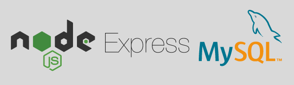

# node.js + MYSQL 最简实现搜索框

*仅为原理学习参考，不考虑其他优化*

## 使用技术
- 前端：`HTML` `CSS` `JS` 
- 后端：`nodejs`、`MySQL`、`express`

## 环境要求
- `nodejs` 16+ lts
- `MySQL` 

## 开始使用
1. 导入 `assets/lemonsread.sql` 至本地的 `Mysql` 来创建对应的 `数据库` 、 `表` 以及所需的数据
2. 更改 `server/index.js` 里的 createConnnection 函数所需对象的属性 `user` `password` 为本地自己的用户名和密码
3. 打开 `terminal` 执行 `npm run start`
4. OK，现在项目已经成功运行了！
